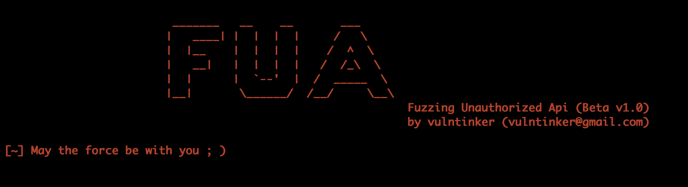
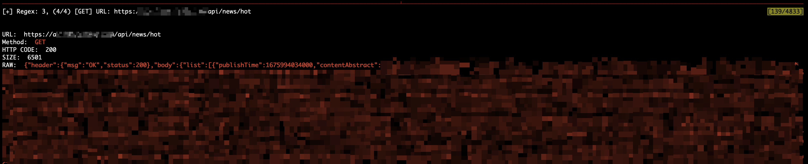
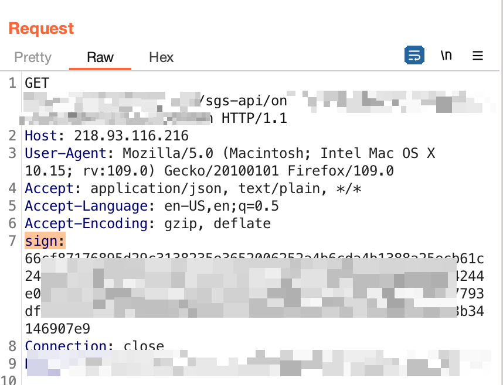
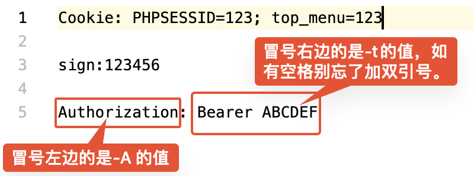

# FUA (Fuzzing Unauthorized Api)



# 简述

把JS文件中存在的相对路径用正则表达式匹配出来，然后无脑的用GET和POST去访问，获取返回结果。

项目是功能堆砌差不多后，一边用一边调的，目前本人代码水平稀烂，BUG肯定会有，多多包涵。

项目的目的是辅助手工判断，希望能有帮助。

建议在macOS/Linux下使用。

# 安装

```
pip install beautifulsoup4 requests termcolor argparse
```


# 使用

关于正则，之前的想法是把baseurl: 和 baseapi:作为关键词匹配后面双引号里的路径，但是在几个站点测试之后发现会漏掉不少，所以直接无脑的用正则匹配双引号和单引号内的路径了，所以肯定会有不少垃圾路径数据，目前使用了not in 一个列表和使用了一个黑名单列表简单处理了。

随机生成参数，这里只进行了非常简单的常识，之前的代码里是加了随机数，但是由于垃圾数据的原因会是得有随机数的URL绕过了列表的过滤，所以就写死了数字，同时也没有进行`?id=`类型的参数尝试，还是保持一边用一边写一边调的原则。代码稀烂，各位包涵。


#### -a  参数

可以直接将任意形式的URL丢入-a，会自动获取网页中存在的JS和可能隐藏在JS中的一些JS相对路径。



如果发现JS路径错误，可以手动看一下是否是因为网站JS目录识别错误的问题，如果js前需要拼接一个路径可以使用-k参数

如 http(s)://example.com 中，js存在的路径是分为pc或mobile，那么可以使用

```shell
python fua.py -a http://example.com -k /pc

python fua.py -a http://example.com -k /mobile
```

则就相当于访问到了http://example.com/pc 目录下的JS


程序有自动发现baseURL的功能，但站点的配置各有不同，识别错误或者漏掉肯定会发生，如有问题，可以手动抓个包看一下接口baseURL的路径，然后使用-b参数，这样就会把-b后的路径拼接到JS中识别到的路径前。

```shell
假设http://example.com 存在 /log/show_logs 这个接口，
它的baseurl是/testapi
程序没有识别到，这个时候使用-b /testapi 就可以把它拼接到所有在JS中匹配到的所有相对路径前。
```



比如这个站点sgs-api没有识别到，就可以使用 -b /sgs-api 这样程序匹配到的每一条路径在访问前都会拼接上它


#### -c 参数

如果接口是非输入的URL，则可以使用-c 指定接口URL，识别到的相对路径则会拼接到改URL后，这个URL需要符合`http(s)://www.example.com:ports`的形式。可以与-b结合使用

```
假设IP：127.0.0.1:80 的接口为127.0.0.1:8081
则可以使用
python fua.py -a http://127.0.0.1:80 -c http://127.0.0.1:8081 -b /testcase-api

程序会识别80端口下网页中的JS，将识别出的相对路径拼接到-c后URL中，如果-b存在，那么会在给新的URL添加上自定义的base
```


#### -j 参数

针对单个JS做相对路径识别，然后无脑请求。

`python fua.py -j http://example.com/0.js`

也可以和-b参数组合使用

`python fua.py -j http://example.com/0.js -b /testapi`


####  身份信息

有的站点可以注册或者通过弱口令还是其他的什么方式能登陆进去，可以添加认证信息对站点进一步测试。


如果需要添加登陆之后的身份信息，可以使用 -A 和 -t 参数添加认证信息。




```
python fua.py -a "http://www.example.com/" -k /pc -b /testapi -A Cookie -t "Session=123456"
```


请求结束后，所有的结果会报存在程序目录下的以URL netloc 为名称的一个txt中。


# 是否有用

emmm，确实扫到过几个信息泄露和未授权，至少可以帮你过滤一下站点在JS中的基本接口信息来进一步做越权测试。

# 注意

本程序仅作为安全学习研究和合法的授权渗透测试！

请不要使用本工具进行未授权渗透测试！

如果意愿交流，可以微信或者邮件：

微信: vulntinker

mail: vulntinker@gmail.com